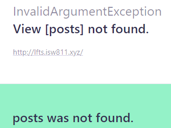
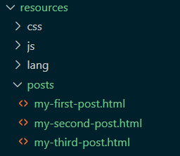
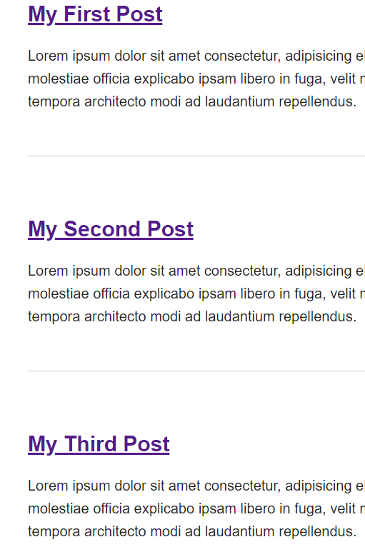
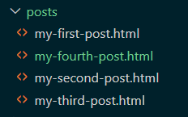

# The Basics

## Route Loads a View.
Dentro del directorio routes, en el recurso web.php se definira cada ruta
a utilizarse en la aplicación.
Estas rutas pueden ser simples como lo siguiente:
```php
Route::get('/', function () {
    return view('welcome');
});
```
O más elaboradas dependiendo de las posibles vistas de la aplicación.
```php
Route::get('/users/hello', function () {
    return view('welcome');
});
```
De igual forma se puede retornar lo que se desee en la vista por ejemplo un vista en formato JSON.
```php
Route::get('/users/hello', function () {
    return ['foo'=>'bar'];
});
```
## Include CSS and JavaScript.
Se modificará el recurso de la página de bienvenida ubicado en `../views/welcome.blade.php`. 
Se desplegara un simple "Hello World". 

```html
<!doctype html>

<title> My Laravel Blog </title>

<body>
    <h1> Hello World!!</h1>
</body>
```
Posteriormente para aplicar estilos creamos un recurso CSS en el directorio public `../public/app.css` que contiene estilos para el body de la página de bienvenida.

```css
body {
    background:olive;
    color: white;
}
```
Finalmente para aplicar dicho estilo a la vista se referencia en la página de bienvenida quedando el bloque
de código de la siguiente forma:

```html
<!doctype html>

<title> My Laravel Blog </title>
<link rel="stylesheet" href="/app.css">

<body>
    <h1> Hello World!!</h1>
</body>

```
## Make a route and link to it.
Desde el proyecto ubicandose en lfts.isw811.xyz/routes, editar el archivo web.php y modificar el nombre de la vista a la que se refiere.

```php
Route::get('/', function () {
    return view('welcome');
});
```
Cambiar para que refiera a una vista llamada `posts`.

```php
Route::get('/', function () {
    return view('posts');
});
```
Este modificacion lanzará un error al cargar el sitio, ya que no encuentra la vista a la que se refiere.



Así que desde el recurso ubincandose en lfts.isw811.xyz/resources/views, editar el nombre del archivo welcome.blade.php a posts.blade.php
y se podra cargar el sitio de manera normal.

Seguidamente editar el archivo `posts.blade.php` con lo siguiente, para simular el post de un articulo.

```html
<!doctype html>

<title> My Laravel Blog </title>
<link rel="stylesheet" href="/app.css">

<body>
    <article>
        <h1> My first Post</h1>
        <p>
            Lorem ipsum dolor sit amet consectetur, adipisicing elit. Minus id magni harum molestiae officia explicabo ipsam libero in fuga, velit magnam nam cupiditate mollitia tempora architecto modi ad laudantium repellendus.
        </p>
    </article>

     <article>
        <h1> My Second Post</h1>
        <p>
            Lorem ipsum dolor sit amet consectetur, adipisicing elit. Minus id magni harum molestiae officia explicabo ipsam libero in fuga, velit magnam nam cupiditate mollitia tempora architecto modi ad laudantium repellendus.
        </p>
    </article>

    <article>
        <h1> My Third Post</h1>
        <p>
            Lorem ipsum dolor sit amet consectetur, adipisicing elit. Minus id magni harum molestiae officia explicabo ipsam libero in fuga, velit magnam nam cupiditate mollitia tempora architecto modi ad laudantium repellendus.
        </p>
    </article>
    
</body>
```
Ahora teniendo estos post se implementa el uso de rutas para ser llevado a otra página por medio de links.

Ubicandose en lfts.isw811.xyz/routes, editar el archivo web.php y agregar una nueva ruta de método `post` quedando de la siguiente forma:

```php
Route::get('/', function () {
    return view('posts');
});


Route::get('post', function () {
    return view('post');
});
```
Ubincandose en lfts.isw811.xyz/resources/views, editar el archivo posts.blade.php, se agregara a los articulos referencia a la nueva ruta creada.

```html
<!doctype html>

<title> My Laravel Blog </title>
<link rel="stylesheet" href="/app.css">

<body>
    <article>
        <h1><a href="/post"> My First Post</a></h1>
        <p>
            Lorem ipsum dolor sit amet consectetur, adipisicing elit. Minus id magni harum molestiae officia explicabo ipsam libero in fuga, velit magnam nam cupiditate mollitia tempora architecto modi ad laudantium repellendus.
        </p>
    </article>

    <article>
        <h1><a href="/post"> My Second Post</a></h1>
        <p>
            Lorem ipsum dolor sit amet consectetur, adipisicing elit. Minus id magni harum molestiae officia explicabo ipsam libero in fuga, velit magnam nam cupiditate mollitia tempora architecto modi ad laudantium repellendus.
        </p>
    </article>
    
    <article>
        <h1><a href="/post"> My Third Post</a></h1>
        <p>
            Lorem ipsum dolor sit amet consectetur, adipisicing elit. Minus id magni harum molestiae officia explicabo ipsam libero in fuga, velit magnam nam cupiditate mollitia tempora architecto modi ad laudantium repellendus.
        </p>
    </article>
</body>
```
Al realizar la referencia se obtendra un error ya que la vista de Post aun no esta creada, para eso ubicarse en lfts.isw811.xyz/resources/views y crear una nueva vista llamada post.blade.php que contiene:

```html
<!doctype html>

<title> My Laravel Blog </title>
<link rel="stylesheet" href="/app.css">

<body>
    <article>
        <h1><a href="/post"> My first Post</a></h1>
        <p>
            Lorem ipsum dolor sit amet consectetur, adipisicing elit. Minus id magni harum molestiae officia explicabo ipsam libero in fuga, velit magnam nam cupiditate mollitia tempora architecto modi ad laudantium repellendus.
        </p>
    </article>
    <a href="/">Go back..</a>
</body>
```
## Store Blog Posts as HTML Files.

Para que el recurso sea más dinámico, crear una variable `$post`, que redijirá y contendrá la información de los post del blog, para ello ubicarse en lfts.isw811.xyz/resources/views y modificar el archivo post.blade.php quedando de la siguente forma:

```html
<!doctype html>

<title> My Laravel Blog </title>
<link rel="stylesheet" href="/app.css">

<body>
    <article>
        <?= $post; ?>
    </article>
    <a href="/">Go back..</a>
</body>
```
Asi mismo ubicarse en lfts.isw811.xyz/resources y crear un nuevo directorio llamado posts, donde se crearan las vistas de los posts, el directorio se verá así:



El siguiente paso es tener una variable `$post` en el archivo de rutas para que apunte a sus respectiva vista, quedando así:

```php
Route::get('posts/{post}', function ($slug) {
    $path = __DIR__ . "/../resources/posts/{$slug}.html";
    if (! file_exists($path)) {
        return redirect('/');
    }
    $post = file_get_contents($path);
    return view('post', [
        'post'=> $post
    ]);
});
```
Para finalizar ya teniendo la página inicial de la siguiente forma:



Se podrá acceder a la información individal de cada post en una página única e independiente, entrando en cada uno de los links.

## Route Wildcard Constraints

Para una mayor eficiencia en las url's del recurso se puede aplicar Regular Expressions para hacer màs entendendibles y estandarisadas, para aplicar esto ubicarse en lfts.isw811.xyz/routes/web.php, modificar el código quedando de la siguiente forma:

```php
Route::get('/', function () {
    return view('posts');
});

Route::get('posts/{post}', function ($slug) {
    $path = __DIR__ . "/../resources/posts/{$slug}.html";
    if (! file_exists($path)) {
        return redirect('/');
    }
    $post = file_get_contents($path);
    return view('post', [
        'post'=> $post
    ]);
})->where('post', '[A-z_\-]+');
```
La última línea agrega las expresiones regulares, lo que se va a permitir que contengan las url's.

## Use caching for expensives operations.

El almacenamiento en caché permite almacenar datos de forma transparente para uso futuro en un intento de hacer que las aplicaciones se ejecuten más rápido, para implementarlo ubicarse en lfts.isw811.xyz/routes/web.php, modificar el código quedando de la siguiente forma:

```php
Route::get('/', function () {
    return view('posts');
});

Route::get('posts/{post}', function ($slug) {
    
    if (! file_exists($path = __DIR__ . "/../resources/posts/{$slug}.html")) {
        return redirect('/');
    }
    //Permite que los datos persistan para un acceso rápido.
    $post = cache()->remember("posts.{$slug}", 1200, fn() => file_get_contents($path));

    
    return view('post', ['post'=> $post]);
})->where('post', '[A-z_\-]+');

```
## Use the Filesystem class to read a directory.

El siguiente paso en el blog es buscar un post en especifico y pasarlo a una vista llamada `post`. Ubicandose en lfts.isw811.xyz/routes/web.php, modificar el archivo quedando de la siguiente forma:


```php
Route::get('/', function () {
    return view('posts');
});

Route::get('posts/{post}', function ($slug) {
       return view('post', [
        'post'=> Post::find($slug)
    ]); 
    
})->where('post', '[A-z_\-]+');
```
Este accion lanza un error ya que no se cuenta con el modelo `Post`, para ello hay que ubicarse en lfts.isw811.xyz/app/Models y crear el modelo llamando Post.php, conteniendo el siguiente código:

```php
<?php
namespace App\Models;
use File;
use Iluminate\Database\Eloquent\ModelNotFoundException;

class Post
{   
    public static function find($slug)
    {   
        if (!file_exists($path = resource_path("posts/{$slug}.html"))) {
            throw new ModelNotFoundException();
        }
        return cache()->remember("posts.{$slug}", 1200, fn() => file_get_contents($path));
    }
}
```
Para hacer las carga de los post del blog más dinámica en la página principal de post realizar los siguientes cambios en el archivo, ubicandose en lfts.isw811.xyz/resources/views/posts.blade.php:

```php
<!doctype html>

<title> My Laravel Blog </title>
<link rel="stylesheet" href="/app.css">

<body>
    <?php foreach ($posts as $post) : ?>
    <article>
      <?= $post; ?>
    </article>
    <?php endforeach;?>
</body>
```
Seguidamente ubicarse en lfts.isw811.xyz/routes/web.php, en la cual se agregará una variable `$posts` en la ruta principal y que será enviada a las vistas para poder cargar los datos del blog.

```php
Route::get('/', function () {
 
    return view('posts', [
        'posts' => Post::all()
    ]);
});

Route::get('posts/{post}', function ($slug) {
       return view('post', [
        'post'=> Post::find($slug)
    ]); 
    
})->where('post', '[A-z_\-]+');
```
Luego ubicarse en lfts.isw811.xyz/app/Models/Post.php, para agregar el método de captura de los posts que se pasaran a la vista, el archivo debe quedar de la siguiente manera:

```php
<?php
namespace App\Models;
use File;
use Iluminate\Database\Eloquent\ModelNotFoundException;

class Post
{   
    public static function all()
    {   
        $files= File::files(resource_path("posts/"));
        return array_map(function($file){
           return $file->getContents(); 
        }, $files);
        
    }

    public static function find($slug)
    {   
        if (!file_exists($path = resource_path("posts/{$slug}.html"))) {
            throw new ModelNotFoundException();
        }
        return cache()->remember("posts.{$slug}", 1200, fn() => file_get_contents($path));
    }
}
```
Esto permitirá la carga de los posts del blog de una forma más natural, más dinámica.
Finalmente a modo de prueba, crear un nuevo recurso post ubicandose en lfts.isw811.xyz/resources/posts, nombrandolo como `my-fourth-post.html`, el directorio se verá de la siguiente manera:



## Find a Composer package for post metadata

### Agregando metadata
Para un mejor control de los recursos html se implementará el uso de metadata. Ubicandose en lfts.isw811.xyz/resources/posts, cambiar los encabezados de los archivos, se visualizaran de la siguiente manera:

```html
---
title: My Fourth Post
excerpt: Lorem ipsum dolor sit amet consectetur, adipisicing elit. 
date: 2022-10-11
---
<h1>My Fourth Post</h1>

<p>
    Lorem ipsum dolor sit amet consectetur, adipisicing elit. Minus id magni harum molestiae officia explicabo ipsam libero in fuga, velit magnam nam cupiditate mollitia tempora architecto modi ad laudantium repellendus.
</p>
```
### Instalar yaml-front-matter
La metadata agregada tiene un nombre formal `YamlFrontMatter`y para referenciar y visualizar esa data en el proyecto se procede a instalar el paquete `yaml-front-matter` vía composer de la siguiente manera:

```php
$ composer require spatie/yaml-front-matter
```
### Modificar el modelo Post para utilizar YamlFrontMatter y Collections
Collection permite realizar operaciones con arreglos de datos, de una forma mucho más sencilla y fácil de leer. Entonces ubicarse en lfts.isw811.xyz/appModels/Post.php y modificar el modelo, el archivo queda de la siguiente forma:

```php
<?php
namespace App\Models;
use File;
use Spatie\YamlFrontMatter\YamlFrontMatter;

class Post
{   
    public $title;
    public $excerpt;
    public $date;
    public $body;
    public $slug;

    public function __construct($title, $excerpt, $date,$body,$slug ){
        $this->title = $title;
        $this->excerpt = $excerpt;
        $this->date = $date;
        $this->body = $body;
        $this->slug = $slug;
    }

    public static function all()
    {   
        return collect(File::files(resource_path("posts")))
            ->map(fn($file) => YamlFrontMatter::parseFile($file))
            ->map(fn($document) => new Post(
                $document->title,
                $document->excerpt,
                $document->date,
                $document->body(),
                $document->slug
            ));
    }

    public static function find($slug)
    {   
      return static::all()->firstWhere('slug',$slug); 
        
    }
}
```
### Editar los archivos de vistas de los posts
Luego para actualizar los archivos de vistas de los posts ubicarse en lfts.isw811.xyz/resources/views, se edita los recursos post.blade.php (vista individual de un post).

```html
<!doctype html>

<title> My Laravel Blog </title>
<link rel="stylesheet" href="/app.css">

<body>
    <article>

        <h1><?= $post->title; ?></h1>
        
        <div>
        <?= $post->body; ?>
        </div>
        
    </article>

    <a href="/">Go back..</a>
</body>
```

Y actualizar el recurso posts.blade.php (vista de todos los posts del blog).
```html
<!doctype html>

<title> My Laravel Blog </title>
<link rel="stylesheet" href="/app.css">

<body>
    <?php foreach ($posts as $post) : ?>
    <article>
      <h1>
        <a href="/posts/<?= $post->slug; ?>">
          <?= $post->title; ?>
        </a>
      </h1>

      <div>
      <?= $post->excerpt; ?>
      </div>
    </article>
    <?php endforeach;?>
</body>
```
 
